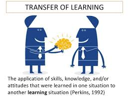

# Fine-Tuning
Pytorch implementation of Fine-Tuning (Transfer Learning) CNN Networks.



## Fine-Tuning
In practice, very few people train an entire Convolutional Network from scratch (with random initialization), because it is relatively rare to have a dataset of sufficient size. Instead, it is common to pretrain a ConvNet on a very large dataset (e.g. ImageNet, which contains 1.2 million images with 1000 categories), and then use the ConvNet either as an initialization or a fixed feature extractor for the task of interest.

Futher explanations can be found [here](http://cs231n.github.io/transfer-learning/).

## Requirements
See the [installation instruction](INSTALL.md) for a step-by-step installation guide.
See the [server instruction](SERVER.md) for server settup.
- Install [cuda-8.0](https://developer.nvidia.com/cuda-downloads)
- Install [cudnn v5.1](https://developer.nvidia.com/cudnn)
- Download [Pytorch for python-2.7](https://pytorch.org) and clone the repository.
```bash
pip install http://download.pytorch.org/whl/cu80/torch-0.1.12.post2-cp27-none-linux_x86_64.whl
pip install torchvision
git clone https://github.com/meliketoy/resnet-fine-tuning.pytorch
```

## Basic Setups
After you have cloned this repository into your file system, open [config.py](./config.py),
And edit the lines below to your data directory.
```bash
data_base = [:dir to your original dataset]
aug_base =  [:dir to your actually trained dataset]
```

For training, your data file system should be in the following hierarchy.
Organizing codes for your data into the given requirements will be provided [here](https://github.com/meliketoy/image-preprocessing)

```bash
[:data file name]

    |-train
        |-[:class 0]
        |-[:class 1]
        |-[:class 2]
        ...
        |-[:class n]
    |-val
        |-[:class 0]
        |-[:class 1]
        |-[:class 2]
        ...
        |-[:class n]
```

## How to run
After you have cloned the repository, you can train the dataset by running the script below.

You can set the dimension of the additional layer in [config.py](./config.py)

The resetClassifier option will automatically detect the number of classes in your data folder and reset the last classifier layer to the according number.

```bash
# zero-base training
python main.py --lr [:lr] --depth [:depth] --resetClassifier

# fine-tuning
python main.py --finetune --lr [:lr] --depth [:depth]

# fine-tuning with additional linear layers
python main.py --finetune --addlayer --lr [:lr] --depth [:depth]
```

## Run various networks

I have added fine-tuning & transfer learning script for alexnet, VGG(11, 13, 16, 19),
ResNet(18, 34, 50, 101, 152).

Please modify the [scripts](./scripts) and run the line below.

```bash

$ ./scripts/[:network].sh 

# For example, if you want to pretrain alexnet, just run
$ ./scripts/alexnet.sh

```

The code above will automatically download weights from the given depth data, and train your dataset with a very small learning rate.

## Feature extraction
For various training mechanisms, extracted feature vectors are needed.

This repository will provide you not only feature extraction from pre-trained networks,

but also extractions from a model that was trained by yourself.

Just set the test directory in the [config.py](config.py) and run the code below.

```bash
python extract_features.py
```

This will automatically create pickles in a newly created 'vector' directory,

which will contain dictionary pickles which contains the below.

Currently, the 'score' will only cover 0~1 scores for binary classes.

Confidence scores for multiple class will be updated afterwards.

```bash
pickle_file [name : image base name]
    |- 'file_name' : file name of the test image
    |- 'features'  : extracted feature vector
    |- 'score'     : Score for binary classification
```

Enjoy :-)
